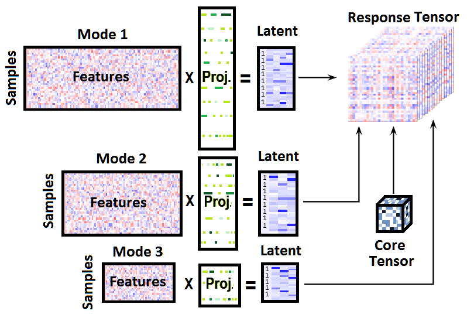

BaTFLED is a machine learning algorithm designed to make predictions and determine interactions in data that varies along three independent modes. For example BaTFLED was developed to predict the growth of cell lines when treated with drugs at different doses. The first mode corresponds to cell lines and incorporates predictors such as cell line genomics and growth conditions. The second mode corresponds to drugs and incorporates predictors indicating known targets and structural features. The third mode corresponds to dose and there are no dose-specific predictors (although the algorithm is capable of including predictors for the third mode if present). 

BaTFLED assumes a generative model where matrices of predictors are multiplied through projection matrices to form latent representations of the input data. These latent representations vectors are analogous to principal component vectors. Matrices containing the latent vectors are combined to form the response tensor which, in this case, are measures of the growth of cell lines after treatment with different drugs at different doses.

The algorithm learns distributions on values in the projection matrices and latent matrices using a Bayesian framework. Prior distributions on the projection matrices can encourge a sparse representation of the input data. Values in the model are learned through variational approximation which maximizes a lower bound on the posterior likelihood by iteratively updating values in the model. This process is deterministic given a random initialization and update ordering.



## Example usage

This document will walk through the use of BaTFLED on a small simulated dataset.

```{r setup, include=F}
# Setting global options
knitr::opts_chunk$set(echo = TRUE)
```

```{r install packages, message=F, warning=F, results='hide'}
library(BaTFLED3D)

# Set up backend for parallel execution
cores <- 4
if(.Platform$OS.type == "windows") {
  clust <- parallel::makeCluster(cores)
  doParallel::registerDoParallel(clust)
} else doMC::registerDoMC(cores)
```

## Generating a simulated dataset

Next we generate simulated data according to the assumed generative model which we will try to reconstruct using BaTFLED. Many aspects of model building can be adjusted, use `?get_data_params` to see them.

```{r generate toy data}
args <- list('decomp=CP',                # Should be either CP or Tucker factorization
            'm1.rows=20', 'm1.cols=80',  # Dimensions of input matrices
            'm2.rows=25', 'm2.cols=100',
            'm3.rows=5', 'm3.cols=0',
            'A1.intercept=T',            # Add intercepts to projection matrices
            'A2.intercept=T',
            'A3.intercept=F',
            'm1.true=8',                 # Number of predictors affecting output
            'm2.true=10',
            'm3.true=0',
            'R=4',                       # Core dimension
            'noise.sd=0.2'               # Amount of Gaussian noise added to responses
)
data.params <- get_data_params(args)
toy <- mk_toy(data.params)
```

The `toy` list contains the input matrices (`mode1.X`, `mode2.X` and `mode3.X`), the sparse projection matrices (`mode1.A`, `mode2.A` and `mode3.A`), the latent matrices (`mode1.H`, `mode2.H` and `mode3.H`), the core tensor (`core` if a 'Tucker' decomposition is used) and the response tensor (`resp`). The matrices and slices of the tensors can be view using `im_mat()`. Note that there are normally some patterns visible in the response tensor.

```{r mode 1 mats, fig.align='center', fig.height=6}
par(mfrow=c(2,2), mar=c(2,2,2,2), mgp=c(1,1,1))
im_mat(toy$mode1.X, main='Mode 1 X', ylab='Samples', xlab='Predictors')
im_mat(toy$mode1.A, main='Mode 1 A', ylab='Predictors', xlab='Latent factors')
im_mat(toy$mode1.H, main='Mode 1 H', ylab='Samples', xlab='Constant + latent factors')
im_mat(toy$resp[,,1], main='Slice of response tensor',
       xlab='Mode 2 samples', ylab='Mode 1 samples')
```

## Training a BaTFLED model

Now that we've built a model, let's see if we can get BaTFLED to learn the values in the projection and latent matrices and the core tensor given just the input data and responses. We separate two of the 'samples' from modes 1 and 2 to be used as test data and form `input_data` objects. We also set a percentage of training responses to `NA` to be used for 'warm start' testing. If the `X` matrices contain constants they are removed since these is optionally added during training.

```{r making train.data}
train.data <- input_data$new(
  mode1.X=toy$mode1.X[-c(1,2), !grepl('const', colnames(toy$mode1.X))],
  mode2.X=toy$mode2.X[-c(1,2), !grepl('const', colnames(toy$mode2.X))],
  mode3.X=toy$mode3.X[, !grepl('const', colnames(toy$mode3.X))],
  resp=toy$resp[-c(1,2),-c(1,2),])

# Remove 'warm.per' percent of responses to be used as 'warm' test data
warm.per <- 0.05
warm.idx <- sample(1:prod(dim(train.data$resp)), prod(dim(train.data$resp))*warm.per)
warm.resp <- train.data$resp[sort(warm.idx)]
train.data$resp[warm.idx] <- NA
train.data$delta[warm.idx] <- 0

m1.test.data <- input_data$new(
  mode1.X=toy$mode1.X[c(1,2), !grepl('const', colnames(toy$mode1.X))],
  mode2.X=toy$mode2.X[-c(1,2), !grepl('const', colnames(toy$mode2.X))],
  mode3.X=toy$mode3.X[, !grepl('const', colnames(toy$mode3.X))],
  resp=toy$resp[c(1,2),-c(1,2),])
m2.test.data <- input_data$new(
  mode1.X=toy$mode1.X[-c(1,2), !grepl('const', colnames(toy$mode1.X))],
  mode2.X=toy$mode2.X[c(1,2), !grepl('const', colnames(toy$mode2.X))],
  mode3.X=toy$mode3.X[, !grepl('const', colnames(toy$mode3.X))],
 resp=toy$resp[-c(1,2),c(1,2),])
m1m2.test.data <- input_data$new(
  mode1.X=toy$mode1.X[c(1,2), !grepl('const', colnames(toy$mode1.X))],
  mode2.X=toy$mode2.X[c(1,2), !grepl('const', colnames(toy$mode2.X))],
  mode3.X=toy$mode3.X[, !grepl('const', colnames(toy$mode3.X))],
  resp=toy$resp[c(1,2),c(1,2),])
```

To train BaTFLED we create and initialize a `model` object. Again there are a lot of parameters to specify, a subset of which are indicated below. To see all available parameters, their descriptions and defaults run `?get_model_params`.

```{r make model}
args <- list('decomp=CP', 'row.share=F',
             'A1.intercept=T', 'A2.intercept=T', 'A3.intercept=F',
             'plot=T', 'verbose=F', 'R=4',
             'm1.alpha=1', 'm2.alpha=1', 'm3.alpha=1',
             'm1.beta=1', 'm2.beta=1', 'm3.beta=1',
             'parallel=T', 'cores=4', 'lower.bnd=T', 
             'update.order=c(3,1,2)', 'show.mode=c(1,2,3)')
model.params <- get_model_params(args)
model <- mk_model(train.data, model.params)
model$rand_init(model.params)
```

`model` is an `R6` object containing A mean matrices (ex. `model$mode1.A.mean`), A covariance arrays (ex. `model$mode1.A.cov`), H mean and variance matrices (ex. `model$mode1.H.mean` and `model$mode1.H.var`), arrays for the core mean and variance (`model$core.mean` and `model$core.var`), an array of predicted responses (`model$resp`) and parameters for the prior distributions. Initially these are random values sampled from Gaussian distributions.

```{r image model, fig.align='center', fig.height=6}
par(mfrow=c(2,2), mar=c(2,2,2,2), mgp=c(1,0,5))
im_mat(model$mode1.A.mean, main='Mode 1 A mean', xlab='Latent factors', ylab='Predictors')
im_mat(model$mode2.A.mean, main='Mode 2 A mean', xlab='Latent factors', ylab='Predictors')
im_mat(model$mode3.H.mean, main='Mode 3 H mean', xlab='Latent factors', ylab='Samples')
if(model.params$decomp=='Tucker')
  im_mat(model$core.mean[,,1], main='Core mean', xlab='mode 2 latent', ylab='Mode 1 latent')
```

We're now ready to train the BaTFLED model. If `params$plot=TRUE` the predictions and some of the learned matrices will be displayed during training. You can adjust which A and H matrices are displayed by changing `params$show.mode`. The observed response values for the 'warm' data are set to zero, so they appear along a vertical line in the first plot. You may want to adjust the number of `cores` depending on how many processors you have on your machine and the number of iterations run `reps`.

```{r train model, message=F, warning=F, results='hide', fig.show='hide'}
reps <- 50

# Data frame to store RMSEs & explained variances for test data while training 
test.results <- numeric(0)

trained <- model$clone()

for(i in 1:reps) {
  train(d=train.data, m=trained, params=model.params)

  if(model.params$decomp=='Tucker') {
    rng <- range(trained$core.mean)
    im_mat(trained$core.mean[1,,], zlim=rng, main="core[1,,]")
    im_mat(trained$core.mean[,,dim(trained$core.mean)[3]], zlim=rng, main="core[,,last]")
  }

  # Get cold results
  test.results <- test_results(m=trained, d=train.data, test.results=test.results,
                               warm.resp=warm.resp, test.m1=m1.test.data, test.m2=m2.test.data,
                               test.m1m2=m1m2.test.data)
}

# Stop cluster (if using parallel package)
if(.Platform$OS.type == "windows") parallel::stopCluster(clust)
```

## Exploring the resulting model

Now that the model has been trained, let's compare the learned matrices to the generating `toy` model. Since the latent factors (columns of the A & H matrices) can be permuted or scaled without changing predictions, the function `im_2_mat` scales and reorders columns of the two matrices and tries to match the latent factors. The new ordering for the second matrix is returned (with negatives indicating negative scaling) so that it can be used to order the core.

```{r compare model matrices, results='hide', fig.align='center', fig.height=6}
par(mfrow=c(3,4), mar=c(2,2,2,2))
im_2_mat(toy$mode1.A, trained$mode1.A.mean, main1='Mode 1 A true', main2='Mode 1 A learned')
m1.H.order <- im_2_mat(toy$mode1.H[-(1:2),], trained$mode1.H.mean, 
                       main1='Mode 1 H true', main2='Mode 1 H learned')
im_2_mat(toy$mode2.A, trained$mode2.A.mean, main1='Mode 2 A true', main2='Mode 2 A learned')
m2.H.order <- im_2_mat(toy$mode2.H[-(1:2),], trained$mode2.H.mean, 
                       main1='Mode 2 H true', main2='Mode 2 H learned')
m3.H.order <- im_2_mat(toy$mode3.H, trained$mode3.H.mean, 
                       main1='Mode 3 H true', main2='Mode 3 H learned')
if(model.params$decomp=='Tucker') {
  core.reorder <- trained$core.mean[abs(m1.H.order), abs(m2.H.order), abs(m3.H.order)]
  core.reorder <- core.reorder * outer(sign(m1.H.order), outer(sign(m2.H.order), sign(m3.H.order)))
  im_2_mat(toy$core[,,1], core.reorder[,,1], sort=F, center=T, scale='all',
           main1='Core mode 1 slice true', main2='Core mode 1 slice learned')
}
```

To quantify how well BaTFLED has chosen predictors we can generate receiver operating characteristic (ROC) curves for each of the modes with predictors. Predictors are 'chosen' if the sum of squared values in the corresponding row of the scaled A matrix is large.

```{r ROC curves, message=FALSE, warning=FALSE, fig.align='center', results='hide', fig.height=3}
par(mfrow=c(1,2), mar=c(3,3,2,2), mgp=c(2,1,0))
plot_roc(toy$mode1.A, trained$mode1.A.mean, main='Mode 1')
plot_roc(toy$mode2.A, trained$mode2.A.mean, main='Mode 2')
```

BaTFLED optionally stores values of the lower bound (`lower.bnd`), root mean squared error (`RMSE`), explained variation (`exp.var`), Pearson correlation (`p.cor`) and Spearman correlation (`s.cor`) for training data.

```{r training measures, fig.align='center', fig.height=6}
par(mfrow=c(2,2), mar=c(3,3,2,2), mgp=c(2,1,0))
if(model.params$lower.bnd) plot(trained$lower.bnd, main='Lower bound')
if(model.params$RMSE)      plot(trained$RMSE, main='Training RMSE')
if(model.params$exp.var)   plot(trained$exp.var, main='Training explained variation')
if(model.params$cor)       plot(trained$s.cor, main='Spearman correlation')
```

Also the `test.results` object in the training loop has stored results for the test data which can be plotted with the functions below.

```{r, fig.align='center', fig.height=10}
par(mfrow=c(2,2))
plot_test_RMSE(test.results, main="Test RMSEs")
plot_test_exp_var(test.results, main="Test explained variances")
plot_test_cor(test.results, main="Pearson correlation")
plot_test_cor(test.results, main="Spearman correlation", method='spearman')
```
